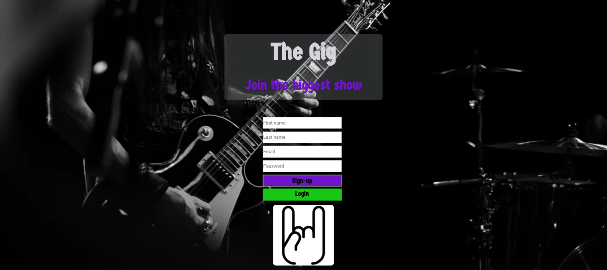
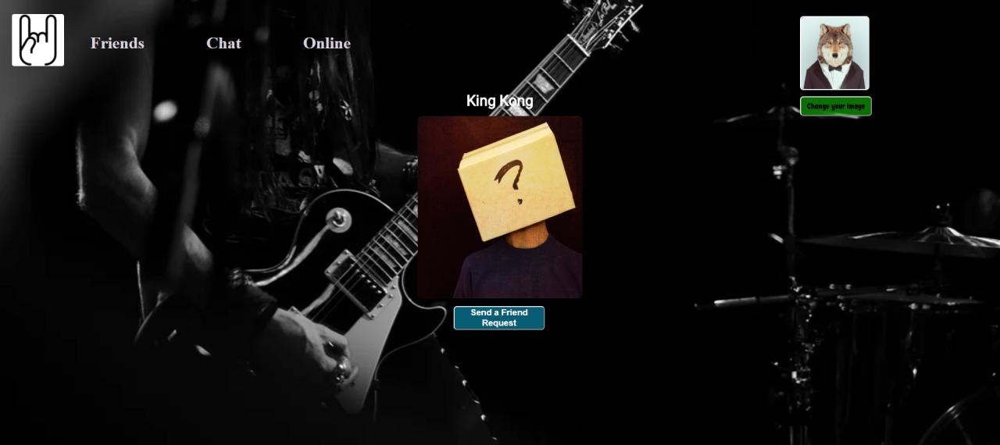
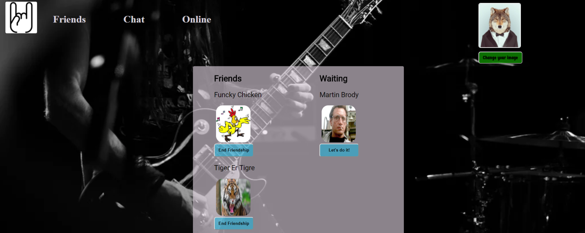
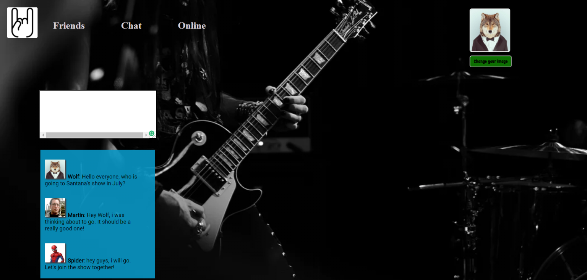

# Social Network "The Gig"

## Summary

The Gig is a social networking application built with the idea to connect people who want to share their experiences and additional information about their favourite gigs.
This is a single-page application made primarily with React.js.
****

## Tech Stack
* React.js and Redux
* Express.js on Node.js
* PostgreSQL Database
* socket.io
* AWS S3 Cloud Storage
* Webpack as a module bundler

## Features

* The web application includes a user registration and a login forms.
* Users can upload profile pictures, if they'd like, otherwise a default one will be assigned to them
* Users can add information about themselves and update it at anytime through an update-profile module
* Similar to other social networking applications, individual users can send friend requests to other members after visiting their respective pages.
* Users can see a list of friends and friendship request waiting for an answer.
* Additionally, users are provided the option to either accept / decline friend requests, as well as the option to 'unfriend' members.
* Users can see in real-time who else is online.
* A public chatroom can be used where every user who is connected can see the last ten messages of the public conversation.

****

********************************
### Send a friendship request

****

****

